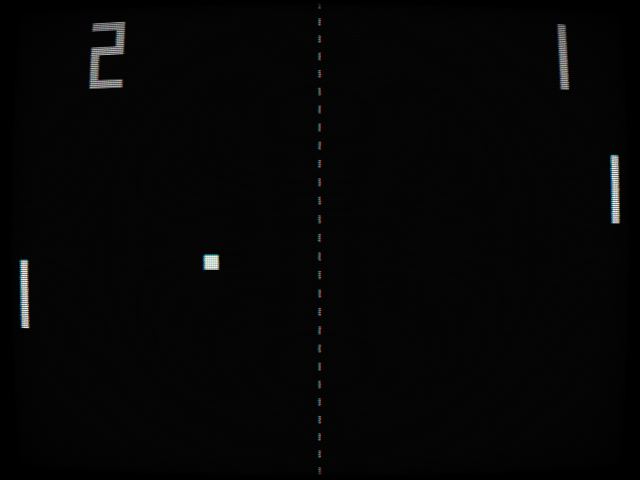
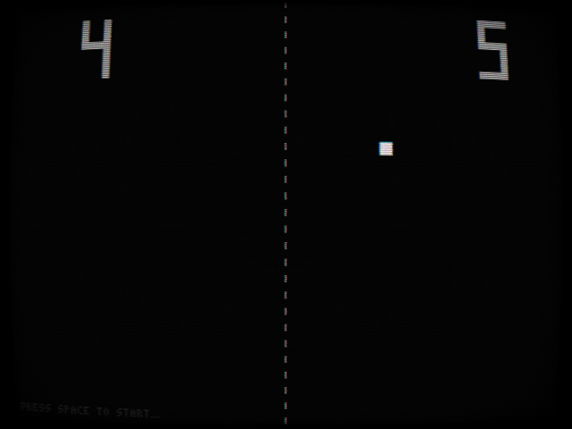
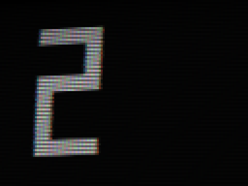

# Pong



An attempt to get as close to the original 1972 Pong as possible: two rectangles,
a square ball, a dashed net down the middle and a big blocky score. No power-ups,
no menus, no particles — only what the cabinet actually had.

With one deliberate exception. The original stood in an arcade and had no "pixels"
in it at all: the picture was drawn by an electron beam sweeping across a cathode
ray tube. So instead of faking chunky pixels, this build runs a post-process that
imitates the tube itself — glass curvature, scanlines, phosphor mask, colour
bleeding around the edges of shapes, vignette and a slight analog signal jitter.

| Attract mode | The CRT up close |
| --- | --- |
|  |  |

A learning project from the **20 Games Challenge**, where Pong is the very first
assignment. Built with Godot 4.7.

## Controls

| Action | Keys |
| --- | --- |
| Left paddle up / down | <kbd>W</kbd> / <kbd>S</kbd> |
| Right paddle up / down | <kbd>↑</kbd> / <kbd>↓</kbd> |
| Start a match | <kbd>Space</kbd> or <kbd>Enter</kbd> |

## Rules

First player to 11 points wins, after which the game drops back into attract mode.

While nobody is playing, the ball bounces off all four walls on its own and the
paddles stay hidden, the way an arcade cabinet idles. The bounce angle depends on
which part of the paddle the ball hits: closer to the edge, sharper the angle.
The longer a rally lasts, the faster the ball travels — it speeds up after the
fourth and the twelfth hit, and resets when a new ball is served.

## Running it

Open the project folder in Godot 4.7 and run the main scene, `scn/level.tscn`.

## What's inside

```
scn/
  level.tscn / level.gd        the field, audio, attract mode switching
  level.gdshader               CRT post-processing
  ball.tscn / ball.gd          ball movement, bounces, serving, speed-up
  paddle.tscn / paddle.gd      paddle, one scene shared by both players
  score.tscn / score.gd        scoreboard and win condition
src/                           fonts and sounds
```

The ball and the paddles are plain `Area2D` nodes: no physics engine is involved,
all movement and bouncing is computed by hand. Both players share a single paddle
scene, and the two instances differ only by an exported `player_id` that selects
which keys they listen to. The ball knows nothing about the score — it just emits
a signal saying which side it left through, and the scoreboard decides who gets
the point.

The repository includes an `addons/` folder with an editor plugin. The game itself
does not need it, but `project.godot` references it, so it ships along.
